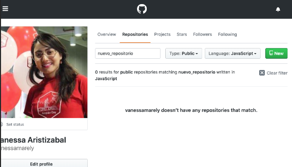
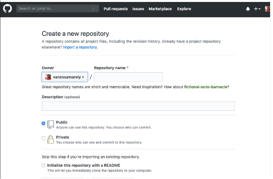
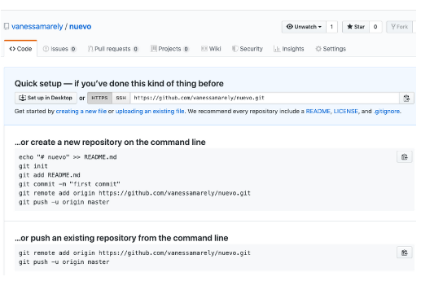
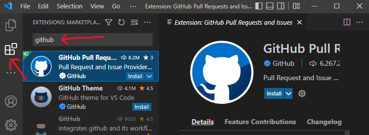
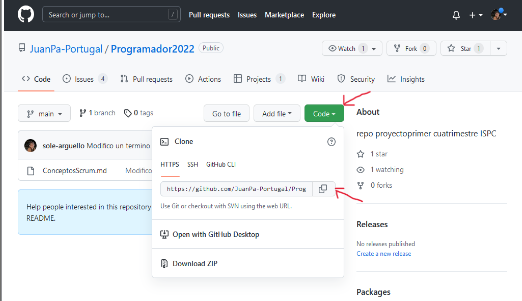
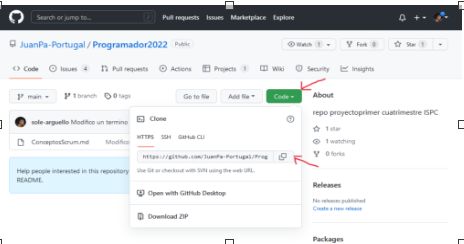
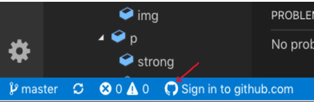
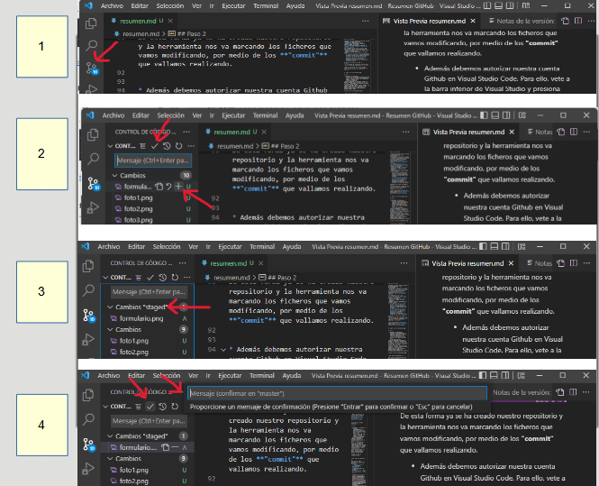

# Programador2022
repo proyecto primer cuatrimestre ISPC

## Resumen Base de Datos

  ### Historia de Base de Datos
 
       Ramiro: historia BD
  
  ### Diseño de bases de datos relacionales
  
        Dario: diseno de base de datos relacionales
  
  ### Introduccion a la Base de Datos
  
        Marco: Introduccion a la BD

  
  ### Sistemas Gestores de Base de Datos(Gestion y Diseño)
  
 ### Tipos fundamentales de sistemas de información (dos puntos determinantes):
 **Sistemas de Información orientados a procesos:**
 Antes la información se trataba y se gestionaba utilizando los típicos sistemas de gestión de archivos que iban soportados sobre un sistema operativo. Éstos        consistían en un conjunto de programas que definían y trabajaban sus propios datos. Los datos se almacenan en archivos y los programas manejan esos archivos para obtener la información. Si la estructura de los datos de los archivos cambia, todos los programas que los manejan se deben modificar. En estos sistemas de información se crean diversas aplicaciones (software) para gestionar diferentes aspectos del sistema; esto trae una única ventaja y es que los procesos son independientes por lo que la modificación de uno no afectaba al resto pero esto también supone un gran inconveniente a la hora de tratar grandes volúmenes de información .A estos sistemas se les llama sistemas de gestión de ficheros.
 *Inconvenientes de un sistema de gestión de archivos:*
- Redundancia e inconsistencia de los datos.
- Dependencia de los datos física-lógica. 
- Dificultad para tener acceso a los datos.
- Separación y aislamiento de los datos.
- Dificultad para el acceso concurrente.
- Dependencia de la estructura del archivo con el lenguaje de programación.
- Problemas en la seguridad de los datos.
- Problemas de integridad de datos (datos inconsistentes).

 **Sistemas de Información orientados a los datos. Bases de Datos.**
 El objetivo primordial de un gestor es proporcionar eficiencia y seguridad a la hora de extraer o almacenar información en una base de datos centralizada y común a todas las aplicaciones (una aplicación modifica un dato, dicho dato la modificación será visible para el resto de aplicaciones). Los sistemas gestores de BBDD están diseñados para gestionar grandes bloques de información, que implica tanto la definición de estructuras para el almacenamiento como de mecanismos para la gestión de la información. 
 Una BD es un gran almacén de datos que se define una sola vez; los datos pueden ser accedidos de forma simultánea por varios usuarios; están relacionados y existe un número mínimo de duplicidad; la descripción de esos datos (metadatos) el BBDD los almacena.

 *Ventajas*                                                              *Desventajas*
- Independencia de los datos y los programas y procesos.                - Instalación costosa.
- Menor redundancia.                                                    - Requiere personal cualificado.
- Integridad de los datos.                                              - Implantacion larga y difícil.
- Mayor seguridad en los datos.                                         - Excesiva dependencia hacia los sistemas comerciales del mercado.
- Datos más documentados. 
- Acceso a los datos más eficiente.
- Menor espacio de almacenamiento. 
- Acceso simultáneo a los datos. 

  
---
## Resumen Metodologías Agiles y Gestión de Proyectos

  ### Metodología Scrum
  Scrum es un marco de trabajo a traves del cual las personas pueden abordar problemas, a la vez que se entregan productos
  de forma eficiente.Sus pilares son:
  - Ciclo de vida interativo e incremental:*Sprint*
  - Transparencia
  - Inspeccion
  - Adaptacion
  Roles de Scrum:
  -Product Owner:representa al cliente
  -Scrum Team:equipo de desarrollo
  -Scrum Master: mediador
  Artefactos:
  -Product Backlog:lista de trabajo
  -Sprint Backlog:objetivos del sprint
  -Incremento:resultado del sprint
  El Sprint es un periodo de corta duracion que debe finalizar con un prototipo operativo parcialmente entregable.
  Ceremonias:
  -Sprint Planning Meeting: reunion de planificaion del sprint
  -Daily Scrum Meeting: reunion periodica
  -Sprint Review Meeting: reunion de revision del sprint
  -Sprint Retrospective Meeting: reunion retrospectiva del sprint.
  
  ### GITHUB - VSC
    
>**¿Qué es GitHub?**

- GitHub es un sitio web y un servicio en la nube que ayuda a los desarrolladores 
  a almacenar y administrar su codigo.
- Permite llevar un registro y control de cualquier cambio en le codigo.
- Es un sistema que ofrece la posibilidad de **colaborar en otros proyectos y publicar los proyectos propios**.
- La plataforma es de **codigo abierto** por defecto, por lo tanto cualquier persona puede
  utilizar tu codigo y a su ves tu puedes ver el codigo de otros proyectos.
- hay dos principios importantes que se deben conocer: 

    1. **Control De Version:** Nos permite llevar un registro y control del código, permitiendo trabajar de forma segura en los proyectos.
    2. **Git:** Es un **sistema de control específico de versión distribuida**. El código y su historial se encuentran disponibles localmente en la computadora de todo desarrollador.

>**Como crear una cuenta en GitHub 📝**

**Paso 1**
- En el navegador de preferencia vamos a colocar : [github.com](https://github.com/ "Click Aqui") 

- Dentro de la página  de incio de GitHub, hacemos clic en **Sign up** y seleccionamos el **plan personal gratuito con repositorio público**.


**Paso 2**

- Completamos el formulario:
    * Usuario (preferentemente tu nombre para que los que vean tus proyectos sepan quien eres).
    * Mail (tu mail personal o uno exclusivo de trabajo o estudio, etc).
    * Crea una contraseña.
- Una vez completado el formulario enviamos el formulario dando clic en el botón **"Sign up for gitHub"** y confirmamos el correo que recibimos en nuestra casilla de mail.
- Una vez confirmada nuestra cuenta, podemos ir a nuestro espacio de GitHub y empezar a crear nuestros repositorios y visitar los que ya tenemos creados. Además de personalizarlo editando nuestro perfil (foto, nombre, datos personales, etc).


>**Como crear un repositorio ✍️**

Para crear un nuevo repositorio hay dos formas de hacerlo:
  1. Desde el **"menu (+)"**, desplegando selecciono **"New  repository"**.
  2. Debes seleccionar la pestaña de **"Repositories"** y damos clic en el **botón (verde) "New"**.

  

EsTas opciones nos llevan a una página donde vamos a colocar:
  1. El nombre del repositorio donde nos indica **"Repository name"**, el campo **Description** es opcional.
  2. Tildar la opcion **"Public o Private"**.
  3. Y vamos a dar clic en el botón **"Create repository"**.

/ Aclaracion: Hay otras opciones a tomar pero las mas comunes son las mencionadas /



Al seleccionar el botón nos quedará una página con la siguiente información:
  * Enlace para subir a Github un proyecto existente ese repositorio o  ir creando nuestros archivos e ir subiendolos a este repositorio.
  * Y los comando para subir nuetro proyecto desde nuestra consola.   



>**Tambien podemos "Clonar un repositorio" 📄➡️📄**.

Previo haber intalado [Visual Studio Code](https://code.visualstudio.com/download) y Git, dentro de **Git** debemos definir (con los comandos) nuestro **usuario e email** de la siguiente manera:

`$ git config --global user.name ` y aseguido  "tu nombre".

` $ git config --global user.email ` y seguido "tumail @dominio.com".

* Tambien debemos tener intalado en nuestro **Visual Studio Code** desde las extenciones a intalar **"GitHub Pull Request"** o tambien desde **"menu / view / Terminal"**.





* Luego estando dentro del proyecto a clonar, en el boton **"code"** despliega una ventana donde encontramos el **"link de repositorio a clonar"**, hacemos click en el **"boton copiar"**.





* Ahora vamos a clonar el proyecto creado en Github desde **Visual Studio Code** de la siguiente manera:

    * Para ello, nos vamos al **menú “view” (ver)**  seleccionamos **“command palette” (paleta de comando)**. 
    * En ese punto buscamos **“git: Clone”**.
    * La herramienta nos pedirá **"la ruta" (URL)** y ahí es donde tenemos que **pegar "la URL del repositorio"** que hemos creado en el punto anterior en Github o del repositorio que queremos clonar.





De esta forma ya se ha creado nuestro repositorio y la herramienta nos va marcando los ficheros que vamos modificando, por medio de los **"commit"** que vallamos realizando.


* Además debemos **autorizar nuestra cuenta Github en Visual Studio Code**. Para ello, vete a la **barra inferior de Visual Studio** y presiona sobre el **"icono de Git"** e introduce tu cuenta de Github.





* Desde la **pestaña de Git** (imagen 1) podemos hacer **el “commit” de los ficheros**. 
    * En primer lugar pulsando ya sea en **“(+)”** para incluir uno a uno los ficheros "O" pulsamos en **“todos (✓)”** para incluir todos los ficheros (imagen 2) a los que queremos hacer **Stage** (imagen 3).
    * Luego en ambos casos, se nos abre una ventana donde **debemos escribir el mensaje del Commit** y pulsar **Intro (Enter)** para terminar (imagen 4).





* Continuando, para hacer **push de los cambios o pull para copiar los datos de servidor** podemos hacerlo de dos maneras:
      
    * Primera opcion: Podemos pulsar en la parte inferior sobre el boton **Sync Changes (sincronizar)** y en este caso haríamos **"push y pull"** (imagen 1).

    * Segunda opcion: Podemos pulsar en **la parte derecha de la barra de git (icono tres puntos)** y elegir la opción **push** o **pull**.


___
___
___
___
  
 
 ## GIT(Ssistema de control de Versiones)

 
  
  
  ### Sistema de control de Versiones

  En el mundo del desarrollo web es importante mantener registrado cada cambio que se realiza a un diseño o programa, usar un **sistema de control de versiones como Git** te va a permitir:

  * Ver de forma detallada quien modifico el codigo
  * volver en el tiempo para regresar a versiones anteriores
  * ver quien introdujo un problema y cuando

sin duda alguna gracias a git podras recuperarte de cualquier perdida o daño de archivos y a un muy bajo costo

### operaciones son locales

las operaciones realizadas en Git solo requieren archivos y recursos locales para funcionar, gracias a que todos los registros, historias de tu proyecto estan en tu disco local,esto significa que ves la historia del proyecto casi instantaneamente

### La integridad con Git

No se puede sufrir corrupcion o perdida de datos sin que git sea capaz de detectarlo ya que git es verificado mediante una suma de comprobacion  antes de ser almacenado y es identificado a partir de ese momento mediante dicha suma

el mecanismo para generar la suma se conoce como **hash SHA-1**
que es una cadena de 40 caracteres hexadecimales


### Repositorios y sus tipos:

el repositorio es el lugar en el que se almacenan los datos actualizados e histotricos de cambios y pueden ser:
* **Locales.-** Los datos guardados localmente y no se comparten con nadie es el mas sencillo de usar y no se recomienda cuando se trabaja en equipo
* **Centralizados.-** Existe un repositorio centralizado de todo el código, del cual es responsable un único usuario,  Se facilitan las tareas administrativas a cambio de reducir flexibilidad, pues todas las decisiones fuertes *(como crear una nueva rama)* necesitan la aprobación del responsable
  * Se realiza en un servidor que se encargará de recibir y dar los cambios realizados en el archivo a cada uno de los usuarios
* **Distribuidos.-** Cada usuario tiene su propio repositorio. Los distintos repositorios pueden intercambiar y mezclar revisiones entre ellos. Es frecuente el uso de un repositorio, que está normalmente disponible, que sirve de punto de sincronización de los distintos repositorios locales.
  * El modelo distribuido es el más utilizado, en este caso cada usuario tiene un control de versiones propio que a su vez son manejadas por el servidor.

###Comandos Para La Configuracion de Git

Una ves instalado Git en tu equipo vamos a usar la consola Git bash para realizar las configuraciones necesarias

 Git config: es un comando que permite configurar  todos los aspectos de cómo funcionará Git de manera local, global o system.

* git config mantiene su valor entre actualizaciones. Por lo tanto, se debe configurar solo una vez. Todos los archivos de configuración tienen la misma sintaxis, pero un alcance diferente. Esto ofrece mucha flexibilidad.

Existe 3  comandos para el almacenamiento:

* Local.
* Global.
*  System.

Además, es importante recordar que cada nivel anula los valores del nivel anterior.

Prioridad:

* Local > Global > System

*  Local: las configuraciones locales están disponibles solo para el repositorio actual. Puede hacer que git lea y escriba desde la computadora que se está utilizando solo localmente
  
        git config --local

*  Global: las configuraciones globales están disponibles para los usuarios actuales para todos los proyectos.

        git config --global


*  System: ésta configuración están disponibles para cada usuario en el sistema y se requiere que tengas permisos de administración.

     git config --system
con estos comandos configuramosnuestro nombre y correo electronico quese mostraran en los commits, por lo general el correo electronico suele ser el mismo de tu git-hub
* git config --global user.name "tu nombre"
* git config --global user.email "tu email"

#### Para configurar el usuario que va a escribir en la bitácora.

Esto mostrará datos de la identidad con la que hemos creado el usuario así como otros datos de la máquina con la que estamos trabajando. Con git config podremos configurar git para registrar diferente identidades, por si usamos un ordenador para diferentes desarrolladores o si nos interesa registrar los cambios bajo diferentes nombres. Esto lo podemos realizar mediante los comandos:
  
  En nuestra imagen colocaremos nuestrasfirmas con nombre y correo electronico conconfiguracion Global

* git config --local user.name "Nombre Apellido"

* git config --local user.email "tuemail@ejemplo.com" (para configurar el usuario que va a escribir en la "Bitácora" desde una máquina).
  

 


### ¿Cómo creas tu primer repositorio?

* El comando **ls** muestra todos los archivos en carpeta.

* El comando **mkdir** (make directory) crea una carpeta la cual contendra tu repositorio (tu archivo *.git*).

      Ejemplo: mkdir nombre-del-proyecto

* cd nombre-del-proyecto/ (para entrar a la carpeta existente).

* **git init** (una vez dentro de la carpeta, ejecutar este comando). con esto tendras tu repositorio creado
  
  
  
### Pasos para añadir archivos a nuestro repositorio y crear nuestros primer commit:

1. Una vez que tenemos ya creadas las carpetas con sus respectivos archivos dentro.
2. Tecleamos **git status**
   
        veremos los archivos listos para ser enviados a nuestra área de preparación, los archivos deben figurar en color rojo.
3. Tecleamos **git add .** Para añadir lo que contiene ambas carpetas

        En caso de querer agregar un archivo especifico se debe teclear Git add "nombre del archivo"
        Para borrar el archivo del área de preparación Git reset.

4. nuevamente tecleamos **git status**.
   
        ahora nos aparecerán los archivos que fueron añadidos en color verde "

5. nuestros archivos están listos para ser commiteados escribimos.


    **git commit -m "mi primer commit "**
               
                
6. **Git log**   con este comando leemos nuestros commit en nuestra vitacora o historial . escribir **q** para salir de la vitacora 

*imagen donde se muestra los comandos git status, git add, git commit -m ""*


___
___
___

  
  
  
## Resumen de ÉTICA Y DEONTOLOGÍA PROFESIONAL

  ### Ética y Deontología
  
  
  ### ÉTICA EN LA INFORMATICA 
  
Para entender y adentrarnos a la EI es necesario abordar primero a el concepto puro de Ética.

La ética es una disciplina filosófica que se define como *"principios directivos que orientan a las personas en cuanto a la concepción de la vida, el hombre, los juicios, los hechos, y la moral”.*
La tecnología informática plantea nuevas situaciones y nuevos problemas y gran parte ellas son de una naturaleza ética.

**La propiedad de los bienes informáticos:**

El software informático es un bien que tiene características específicas. Parece que el problema podría subsumirse y reducirse a la protección de la propiedad intelectual. Al plantearnos la protección de software surgen nuevos problemas posesión de propiedad, atribución, pirateo, plagio, derechos de autor, secretos industriales, derechos sobre productos, etc. Unido a esto están los problemas de 3 cesión de software comercial, la producción de software nuevo a partir de un programa ya existente, la mejora de productos utilizando materiales registrados de la competencia, etc.

**Lo informático como instrumento de actos potencialmente dañinos:**

 Las personas que proveen servicios informáticos y los que utilizan ordenadores, datos y programas han de ser responsables de la integridad y conveniencia de los resultados de sus acciones. Aquí se menciona lo siguiente:
 
•	Las consecuencias de los errores en datos y algoritmos.

•	Problemas que pueden ser causados por la falta de protección en la seguridad de sistemas con datos sensibles o que implican riesgos en la salud de clientes. 

•	Los actos de terrorismo lógico.

•	Las acciones de fanáticos. 

•	El espionaje de datos.

•	Las introducciones de virus y gusanos. 

**la Inteligencia artificial.**

 La EI toma en consideración de las visiones antropomórficas sobre los ordenadores como máquinas pensantes o como productores de verdades absolutas e infalibles. Sin embargo, también plantean problemas éticos. Por un lado, los referentes a los valores internos a los sistemas , por otro lado, posibles sesgos escondidos en el proceso de toma de decisiones; por último, hasta qué punto son los diseñadores de estos sistemas responsables de los resultados de los mismos
 
**Dimensiones sociales de la informática.**

 La informática ha contribuido en el desarrollo de las tecnologías de la información, contribuyendo de esta manera en el desarrollo positivo de los medios de comunicación social. En consecuencia de ello podemos mencionar que los informáticos han sido unos trabajadores claves de la tecnología militar. Desde la EI se podría concienciar a los informáticos sobre la eticidad de desarrollar modos "superinteligentes" para idear sufrimiento y destrucción humana y de alimentar mercados militares en países en desarrollo por parte de los que poseen tecnología.
Esto es un problema que se da debido a la poca diversidad cultural de los sistemas y medios de información y comunicación que nos invaden.


**LA DEONTOLOGÍA INFORMÁTICA.**

La deontología es la parte de la ética que trata sobre los deberes, especialmente relacionados con el ejercicio de una determinada profesión. 
La Deontología informática hace referencia a la ciencia o tratado de los deberes y normas éticas, que conciernen a los profesionales que a diario están en contacto con la tecnología y los medios masivos de comunicación como internet. Por lo tanto trata, de la moral o ética profesional en el manejo de la información. 
 
 **LOS CÓDIGOS ÉTICOS.**
 
*"Los códigos de ética, tal como se conocen en el mundo de las empresas, son sistemas de reglas establecidos con el propósito general de guiar el comportamiento de los integrantes de la organización y de aquellos con los cuales ésta actúa habitualmente: clientes, proveedores y contratistas. No obstante la profesión de informática, es una actividad reconocida socialmente y así el futuro profesional informático, debe estar preparado para que un juez o una empresa le solicite un dictamen o peritaje informático y es evidente que este tipo de informes, en la práctica, deben estar firmados por alguien con titulación superior, actuando con Probidad profesional, y obrando según ciencia y conciencia."*

**Los diez mandamientos de la ética informática**

 1) No usarás una computadora para dañar a otros.
 2) No interferirás con el trabajo ajeno. 
3) No indagarás en los archivos ajenos. 
4) No utilizarás una computadora para robar.
 5) No utilizarás la informática para realizar fraudes. 
6) No copiarás o utilizarás software que no hayas comprado. 
7) No utilizarás los recursos informáticos ajenos sin la debida autorización.
 8) No te apropiarás de los derechos intelectuales de otros.
 9) Deberás evaluar las consecuencias sociales de cualquier código que desarrolles. 
10) Siempre utilizarás las computadoras de manera de respetar los derechos de los demás. 

**LA ÉTICA EN INTERNET** 

Internet es el último y el más poderoso de una serie de medios de comunicación. Como sucede con otros medios de comunicación, la persona y la comunidad de personas son el centro de la valoración ética de Internet. Con respecto al mensaje comunicado, al proceso de comunicación y a las cuestiones estructurales y sistemáticas de la comunicación La cuestión ética consiste en saber si esto está contribuyendo al auténtico desarrollo humano y ayudando a las personas y a los pueblos a ser fieles a su destino trascendente. Internet tiene un conjunto de características impresionantes como lo describimos a continuación: 

• Instantáneo. 

• Inmediato. 

• Mundial. 

• Descentralizado. 

• Interactivo. 

Capaz de extender ilimitadamente sus contenidos y su alcance, flexible y adaptable. Puede emplearse para romper el aislamiento de personas y grupos o al contrario, para profundizarlo, Internet le sirve a la gente en su ejercicio responsable de la libertad y la democracia, a ampliar la gama de opciones realizables en diversas esferas de la vida, ensanchar los horizontes educativos y culturales, superar las divisiones y promover el desarrollo humano.

 **Los problemas éticos más significativos en Internet.**
 
En gran medida el desarrollo científico y tecnológico de este siglo ha sido impulsado por intereses vinculados con el afán de la hegemonía mundial de las grandes potencias, a las exigencias del desarrollo industrial, así como a las pautas de consumo que se producen y se difunden desde las sociedades que han marcado la avanzada en los procesos de modernización. A continuación, una lista sobre los problemas éticos:

• La privacidad: no tanto la posibilidad (real) de fallos en los sistemas de correo, sino más bien la intromisión intencional.

 • La Identidad: es posible esconder la verdadera identidad a la hora de intervenir en una conversación. 
 
• La Inversa: la capacidad de manipulación se traslada de los mecanismos habituales a la sociedad (como la posición social económica) a las habilidades de aquellos que manejan más el medio o que pueden intervenir de manera subrepticia en las comunicaciones ajenas. 


 **LA SOCIEDAD DE LA INFORMACIÓN.** 
 
 
La Sociedad de la Información es resultado, de los procesos que podríamos llamar de informatización que se producen en los Estados Nacionales, por medio de los cuales se hace posible que actores de cada vez más amplios sectores sociales tengan acceso al uso de las TICs (tecnologías de información y comunicaciones) para su participación en la vida social. Vistas las cosas así, integrando la visión local con la global, una sociedad, un país, un Estado-Nación particular puede no ser una Sociedad de la Información, pero, a través de algunos de sus sectores sociales, participar de la Sociedad de la Información. Pero en los países de América Latina y el Caribe los que forman parte de la Sociedad de la Información son minoritarios por lo que afirmamos que las sociedades latinoamericanas no son sociedades de la información. En ellas están presentes en grados relativamente bajos, en todo caso, son sociedades en proceso de informatización; en camino de llegar a ser sociedades de la información, si las vemos desde la óptica evolucionista que impregna mayoritariamente a la opinión especializada en el área.


  ### Seguridad en la red
A traves de internet, podemos conectarnos con todo el munod y realizar infinidad de tareas, sin embargo, también es muchas veces el medio por las que accedemos a virus y es también utilizado como medio por los hackers para robarnos
información con el fin de obtener algún beneficio.

Para protegernos podemos utilizar un buen antivirus, un VPN para redes publicas, un navegador anónimo, entre otros; aunque tomemos todas las medidas de seguridad nunca estaremos completamente protegidos. A continuación veremos algunos ejemplos de inseguridad que suceden a diario:
* En las redes sociales: un atacante puede acceder a datos personales e invadir nuestra privacidad con lo que hemos publicado, ademas puede conocer la ubicación de alguien solo accediendo a sus actualizaciones.
* Descargas: Al descargar archivos a nuestra pc o dispositivo corremos grandes riesgos, pues podemos descargar software malicioso que se diseño para dañar software o instalar software no deseado, el cual provoca comportamientos engañosos inesperados o perjudiciales para el usuario cuando utiliza el equipo o navega por la red.
* Contraseñas: para descifrar contraseñas se utilizan sistemas programados, por lo que se deben utilizar contraseñas con un tamaño preferiblemente largo (minimo 8 caracteres), debe contener caracteres especiales, mayúsculas, minúsculas y de 1 a 4 números  y evitar frases que nos identifiquen como la fecha de nacimiento, el nombre de la mascota, etc.

Hacking
Contrario al concepto conocido de un hacker, no es una persona con malas intenciones, por el contrario, se encarga de hallar vulnerabilidades en un sistema para mejorarlo y hacerlo mas seguro. La finalidad de la utilización de esas vulnerabilidades es lo que hace a un hacker malicioso o no.
Las tecnicas mas conocidas de hacking utilizadas actualmente son:
- CLICKJACKING: el atacante utiliza varias capas para engañar al usuario que hace click en un botón y es redirigido a una página externe (fuara de la original).
- PHISHING: se utiliza para obtener información personal, como su nombre de usuario, contraseña y detalles de tarjetas de crédito, fingiendo la identidad de otra persona, o entidad de confianza, mediante un mensaje de correo electrónico o a través de una página web.
- EAVESDROPPING: este método consiste en un ataque pasivo en el cual los sistemas informáticos y las redes se supervisan para que el atacante obtenga cierta información relevante.
- FAKE WAR: en lugares donde encontramos redes de wifi abiertas, algunos atacantes utilizan software y tarjetas inalámbricas para configurar una IP falsa y simular una red real. Al conectarse a la red, el usuario le da acceso a toda la información que envía por medio dedicha red.
- KEYLOGGER: es un software o un hardware que puede interceptar y guardar las pulsaciones realizadas en el teclado de un equipo que haya previamente infectado. Este malware se sitúa entre el teclado y el sistema para interceptar y registrar la información sin que el usuario lo note. Además un Keylogger almacena datos en forma local en el ordenador infectado y permite que el atacante tenga acceso remoto al equipo de la víctima y registrar información del otro equipo.

¿Cómo protegernos?
La protección depende más del usuario que del sistema, ya que hay que conocer un poco de seguridad para poder evitar algunos ataques; sin embargo, se puede seguir ciertos consejos:
- El usuario debe ser precavido, intentando comprobar remitentes y sitios auténticos. Es de suma importancia no realizar transacciones financieras a traves de redes públicas, ni acceder a cuentas con información personal. 
- No intalar software gratuito pirateado o sospechoso.
- Cambiar las claves periodicamente
- Utilizar un navegador actualizado
- Utilizar VPN y evitar el trafico HTTP

 
  ### Seguridad informática
  
La Seguridad Informática se refiere a las características y condiciones de los sistemas de
procesamiento de datos y su almacenamiento, para garantizar su confidencialidad, integridad y 
disponibilidad.
Es decir, su funcion es la proteccion de la informacion, en contra de amenazas o peligros, para evitar daños y para minimizar riesgos, relacionados con ella. 

 - Seguridad de la Informacion: Es el conjunto de medidas preventivas y reactivas que permiten resguardar y proteger la información.
El objetivo de la protección son los datos mismos y trata de evitar su pérdida y modificación
no-autorizada.

 - Proteccion de Datos: Se encarga de proteger los datos personales de las personas es decir, se refiere a medidas de protección de la privacidad digital que se aplican para evitar el acceso no autorizado a los datos, los cuales pueden encontrarse en ordenadores, bases de datos, sitios web, etc. Para asi prevenir una posible corrupcion o un abuso de esta.

#### Algunos conceptos que debes conocer

 - Ransomware: Es un tipo de malware que cifra los archivos y hasta sistemas informáticos enteros para luego pedir el pago de un rescate a cambio de devolver el acceso.
Por ende los ingenieros de seguridad se ocupan de proteger la red de las amenazas, ellos diseñan sistemas que protegen las cosas y los implementa, realizan pruebas hasta hacerlos cada vez más seguros, realizan revisiones regulares de código como así también crean arquitecturas de seguridad para mantener bloqueada y segura la red.

 - Encriptacion: Protege los datos y archivos reales almacenados en ellos o que viajan entre ellos a través de Internet. Las estrategias de encriptación son cruciales para cualquier empresa que utilice la nube y son una excelente manera de proteger los discos duros, los datos y los archivos que se encuentran en tránsito a través de correo electrónico, en navegadores o en camino hacia la nube.
En el caso de que los datos sean interceptados, la encriptación dificulta que los hackers hagan algo con ellos. Esto se debe a que los datos encriptados son ilegibles para usuarios no 
autorizados sin la clave de encriptación.

 - Tokenizacion: Es el proceso que permite proteger datos sensibles, sustituyéndolos por 
equivalentes no-sensibles, conocidos como tokens. Se utiliza para evitar el robo de datos en las transacciones con tarjetas bancarias.

 - Firewall: Es un software o hardware que se encarga de bloquear el acceso a la red a usuarios no autorizados. Tambien se encarga de evitar la interceptación de datos y bloquear el malware que intenta entrar en la red, y también evitan que la información importante salga, como contraseñas o datos confidenciales.

#### Claves para proteger tus datos personales

##### Actualizarse

Las apps de nuestros dispositivos pueden actualizarse de forma manual o permitir que se 
actualicen automáticamente. Si mantenemos las apps actualizadas, se podrá acceder a las 
funciones más recientes con mejoras de estabilidad y seguridad. Esto permite solucionar las 
fallas y errores de versiones anteriores, como los que registran la protección de datos.

##### La privacidad

Los bares y locutorios ofrecen acceso rápido y barato a redes WIFI o a una PC con internet, 
pero no sabemos quién puede acceder a ese dispositivo, ni cuáles son las medidas de seguridad 
que posee. Por lo tanto, nunca se deben ingresar datos privados ni acceder a servicios 
autenticados, como email, redes sociales y homebanking desde ese tipo de dispositivos.

##### Terminos y Condiciones

Es importante leer los términos y condiciones antes de instalar una aplicación o servicio, 
para saber si estamos dándole permiso para almacenar nuestros datos en la nube. Si esto ocurre, el servidor se convierte en el dueño de los datos y el usuario pierde el control de su información. Además, es primordial configurar la privacidad de las publicaciones en redes 
sociales.

##### Mensajes Falsos 

Una de las principales formas de engaño y robo de datos es enviar a los usuarios archivos, 
formularios, y solicitudes de contacto a través de perfiles y cuentas falsas. Es ideal no 
responder a mensajes que soliciten información confidencial, aunque digan ser de entidades de 
confianza. 

##### Utilizar aplicaciones seguras 

Asegurarse de que una aplicación está libre de virus y malware. Existen sitios web de descarga gratuita de programas que engañan a los usuarios y al descargar la aplicación se ejecutan de forma oculta contenidos maliciosos que destruyen o que se apropian de los datos almacenados.

##### ¿Cómo crear una buena contraseña? 

Las contraseñas más robustas y complejas son aquellas que combinan mayúsculas, minúsculas, 
símbolos y números, no se recomienda utilizar la misma contraseña en todos los servicios ni 
incluir fechas de nacimiento, aniversarios, números de teléfono o fragmentos del DNI. En el 
caso de sospechar que una contraseña haya sido comprometida, lo ideal es cambiarla al instante. 

##### Back up 

Es importante que siempre se realicen copias de seguridad de la información en medios de 
almacenamiento extraíbles, como DVD regrabables, discos externos o Pendrives USB. A la vez, 
podemos contar con programas que realicen backups automáticos sin que sea necesaria ninguna 
intervención por parte del usuario para su ejecución.
 
  ### Dilema en las Redes Sociales
“Hay dos industrias que llaman a sus clientes usuarios: la de las drogas ilegales y la del software". 
La frase aparece en uno de los momentos más comentados del documental The Social Dilemma ("El dilema de las redes sociales"), que se estrenó en febrero de 2020 en el Festival de Cine de Sundance, en Estados Unidos.
Concluido con testimonios de algunos exejecutivos de las empresas más grandes de Silicon
Valley y de académicos, el filme describe la adicción y los impactos negativos de las redes sociales en personas y comunidades, como resultado de las estrategias diseñadas para manipular emociones y comportamientos, y mantener conectados a los usuarios. 
Así, según «El dilema de las redes sociales», experiencias digitales aparentemente triviales, como recomendaciones automáticas, notificaciones y publicaciones presentadas, funcionarían como un cebo que es lanzado por las aplicaciones más populares del planeta. Clasificado como docudrama -una fórmula que mezcla testimonios del documental tradicional con escenas dramatizadas-, la película ha sido descrita como una ventana a las mesas de decisión de gigantes de Silicon Valley como Facebook, Twitter y Google.
Luego, se ofrece información sobre los usuarios a los clientes, desde marcas de cosméticos y universidades hasta políticos y gobiernos, que pagan millones de dólares por mostrar productos o ideas a audiencias que estén dispuestas a participar. Sin embargo, el engranaje solo funciona si los usuarios permanecen conectados a sus perfiles y, por lo tanto, pueden estar expuestos al máximo número de anuncios. 
Estas son herramientas diseñadas para engancharnos y manipularnos. Una de las voces principales de la película es Tristán Harris, un exingeniero de Google que trató de advertir a sus colegas sobre el riesgo de adicción a los usuarios, y dice que fue ignorado. 
«El dilema de la redes sociales», describe las herramientas que se crean para mantener a los usuarios «distraídos» mientras los anunciantes ganan dinero.
La dinámica de «me gusta» y comentarios con elogios o críticas se estimularía para manipular y hacer dependientes a los usuarios, según los entrevistados, las mismas son las validaciones recibidas por elogios, y aportan un sentimiento de felicidad o logro a los usuarios.  Así, a medida que cada validación recibida en línea genera nuevos impulsos artificiales de dopamina, las redes mantienen conectada a una legión de usuarios cada vez más solitarios y necesitados, sin autonomía para discernir entre la realidad y la virtualidad.
  
  
  
  


---
---
# tips para usar MARK DOWN :smiley:  :point_down:


# titulo1

##titulo2

###titulo3

####tit4

#####tit5

this es an *italic* text

this is an **strong** text

this is an ~~tachable~~ text

<!-- UL -->

* Apple
  * opple2
* mac
* etc

<!-- ol -->
1. order1
2. order2
   1. order2.1
   2. order2.2

<!-- enlaces -->
[googole](https://google.com "mostrando mensaje")

<!-- Citas -->
> this is a quote

> this is two quote

<!-- lineas -->
---
___

<!-- lienas de codigo -->
`consoole.log`

```html
<head>
    <meta charset="UTF-8">
    <meta http-equiv="X-UA-Compatible" content="IE=edge">
    <meta name="viewport" content="width=device-width, initial-scale=1.0">
    <link rel="stylesheet" href="reset.css">
    <link rel="stylesheet" href="style.css">
    <title>Productos</title>
</head>
```
<!-- en el cabezal de las comillas poner nombre del lenguajede codigoque estas mostrando -->
```javascript
function execRegex(valores) {
  let textoPattern = valores.pattern; //dateFormat();
  let textoTarget = valores.target;
  let mostrarIndex = valores.mostrarIndex;
  let mostrarGrupos = valores.mostrarGrupos;

  let resultados = [];
  let resultado = null;
```
<!-- tablas -->

| col1    |col2   |col3  |
|---------|:-----:|-----:|
| col1    |col2   |col3  |
| col1    |col2   |col3  |

<!-- imagenes -->
<!-- en caso de imagens locales guardas la imagen dentro la misma carpeta del documento -->


<!-- github markdown to do -->
*[x] Task 1

*[x] Task 2

*[ ]  Task 3
